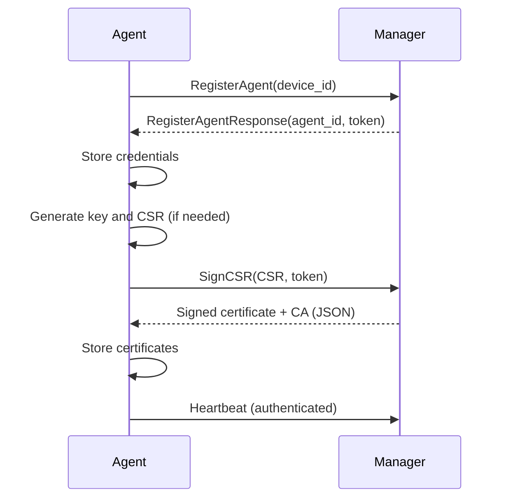

# Enrollment

This document describes the step-by-step process for enrolling an OpenShield Agent with the Manager.

---

## 1. Prerequisites

- Agent binary is installed on the target machine.
- Manager address and ports are known.
- `osquery` is installed and available in PATH. (optional)
- The agent must have access to generate and store certificates in the `certs` directory.

---

## 2. Enrollment Steps

### Step 1: Start the Agent (User)

- The agent is started manually or as a systemd service.
- Manual example:
  ```sh
  ./openshield-agent -manager <MANAGER_ADDRESS> -config <CONFIG_PATH> -scripts <SCRIPTS_PATH>
  ```
- `systemd` example:
  ```
  systemctl enable openshield-agent.service
  systemctl start openshield-agent.service
  ```

### Step 2: Generate or Load Device ID (Agent)

- The agent checks for an existing device ID.
- If not found, it generates a new unique device ID.

### Step 3: Register with Manager (Agent)

- The agent sends a registration request to the manager via gRPC:
  - Includes device ID and other metadata.
- Manager responds with:
  - Agent ID
  - Agent token (for authentication)

### Step 4: Store Credentials (Agent)

- Agent securely stores the received credentials:
  - In OS keyring (preferred)
  - As a fallback, in a local file with restricted permissions

### Step 5: Generate Private Key and CSR (Agent)

- The agent checks for an existing private key (`certs/agent.key`) and CSR (`certs/agent.csr`).
- If not found, it generates a new RSA private key and a Certificate Signing Request (CSR) with the agent's identity.
- The private key and CSR are saved in the `certs` directory.

### Step 6: Request Certificate Signing (Agent)

- The agent sends the CSR to the manager's certificate signing endpoint, authenticated with the agent token.
- The manager responds with a signed agent certificate and the CA certificate (in JSON format).
- The agent saves the signed certificate (`certs/agent.crt`) and CA certificate (`certs/ca.crt`) in the `certs` directory.

### Step 7: Confirm Enrollment (Agent)

- Agent logs successful enrollment and certificate setup.
- Agent is now ready to receive tasks, send heartbeats, and communicate securely with the manager.

---

## 3. Error Handling

- If registration or certificate signing fails, the agent retries after a delay.
- If credentials or certificates cannot be stored, the agent logs an error and exits.

---

## 4. Re-enrollment

- To re-enroll, clear credentials and certificates using the provided utility or manually remove keyring entries, credential files, and certificates.
- Restart the agent to trigger a new enrollment and certificate request.

---

## 5. Sequence Diagram



---